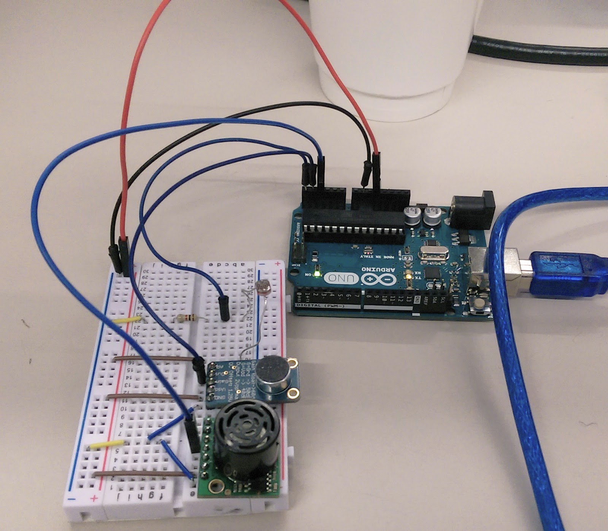

# Trappa

## trappa-sensor

```
cd sensor
npm install
npm run sensor
```


## trappa-dashboard

```
cd dashboard
npm install
npm run dashboard
```

## trappa-external-data

```
cd external-data
npm install
npm run ext
```

## trappa-shaderbonanza

Double click the `shaders.html` file.


*Diagram*



## IP
10.0.20.146